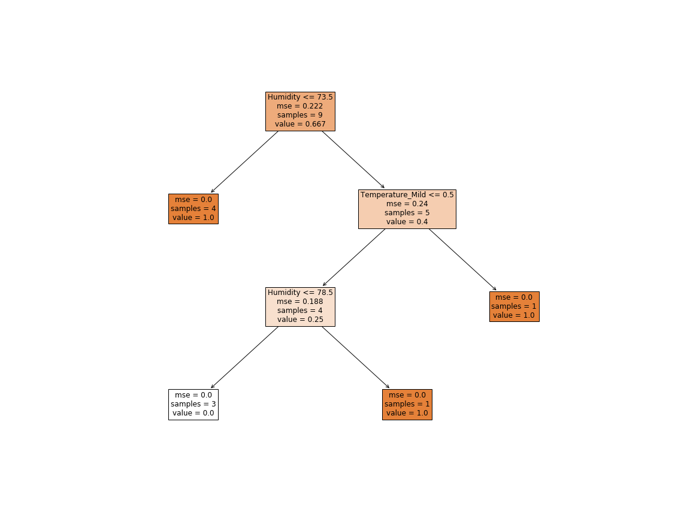

# Practical 08: Implement Decision tree classifier and regressor using sklearn
[](https://www.linkedin.com/in/sagar-darji-7b7011165/)


# Decision Tree Classification Algorithm:
- Decision Tree is a Supervised learning technique that can be used for both classification and Regression problems, but mostly it is preferred for solving Classification problems. It is a tree-structured classifier, where internal nodes represent the features of a dataset, branches represent the decision rules and each leaf node represents the outcome.
- In a Decision tree, there are two nodes, which are the Decision Node and Leaf Node. Decision nodes are used to make any decision and have multiple branches, whereas Leaf nodes are the output of those decisions and do not contain any further branches.
- The decisions or the test are performed on the basis of features of the given dataset.
- It is a graphical representation for getting all the possible solutions to a problem/decision based on given conditions.
- It is called a decision tree because, similar to a tree, it starts with the root node, which expands on further branches and constructs a tree-like structure.
- In order to build a tree, we use the CART algorithm, which stands for Classification and Regression Tree algorithm.
- A decision tree simply asks a question, and based on the answer (Yes/No), it further split the tree into subtrees.
- Below diagram explains the general structure of a decision tree:


`Note: A decision tree can contain categorical data (YES/NO) as well as numeric data.`

## Why use Decision Trees?
There are various algorithms in Machine learning, so choosing the best algorithm for the given dataset and problem is the main point to remember while creating a machine learning model. Below are the two reasons for using the Decision tree:
  - Decision Trees usually mimic human thinking ability while making a decision, so it is easy to understand.
  - The logic behind the decision tree can be easily understood because it shows a tree-like structure.
  
### Decision Tree Terminologies
- `Root Node`: Root node is from where the decision tree starts. It represents the entire dataset, which further gets divided into two or more homogeneous sets.
- `Leaf Node`: Leaf nodes are the final output node, and the tree cannot be segregated further after getting a leaf node.
- `Splitting`: Splitting is the process of dividing the decision node/root node into sub-nodes according to the given conditions.
- `Branch/Sub Tree`: A tree formed by splitting the tree.
- `Pruning`: Pruning is the process of removing the unwanted branches from the tree.
- `Parent/Child node`: The root node of the tree is called the parent node, and other nodes are called the child nodes.

### How does the Decision Tree algorithm Work?

In a decision tree, for predicting the class of the given dataset, the algorithm starts from the root node of the tree. This algorithm compares the values of root attribute with the record (real dataset) attribute and, based on the comparison, follows the branch and jumps to the next node.

For the next node, the algorithm again compares the attribute value with the other sub-nodes and move further. It continues the process until it reaches the leaf node of the tree. The complete process can be better understood using the below algorithm:

  ***Step-1***: Begin the tree with the root node, says S, which contains the complete dataset.
  
  ***Step-2***: Find the best attribute in the dataset using Attribute Selection Measure (ASM).
  
  ***Step-3***: Divide the S into subsets that contains possible values for the best attributes.
  
  ***Step-4***: Generate the decision tree node, which contains the best attribute.
  
  ***Step-5***: Recursively make new decision trees using the subsets of the dataset created in step -3. Continue this process until a stage is reached where you cannot further classify the nodes and called the final node as a leaf node.
  
`Example`: Suppose there is a candidate who has a job offer and wants to decide whether he should accept the offer or Not. So, to solve this problem, the decision tree starts with the root node (Salary attribute by ASM). The root node splits further into the next decision node (distance from the office) and one leaf node based on the corresponding labels. The next decision node further gets split into one decision node (Cab facility) and one leaf node. Finally, the decision node splits into two leaf nodes (Accepted offers and Declined offer). Consider the below diagram:


### Attribute Selection Measures
While implementing a Decision tree, the main issue arises that how to select the best attribute for the root node and for sub-nodes. So, to solve such problems there is a technique which is called as Attribute selection measure or ASM. By this measurement, we can easily select the best attribute for the nodes of the tree. There are two popular techniques for ASM, which are:
  - Information Gain
  - Gini Index
  
***1. Information Gain:***
- Information gain is the measurement of changes in entropy after the segmentation of a dataset based on an attribute.
- It calculates how much information a feature provides us about a class.
- According to the value of information gain, we split the node and build the decision tree.
- A decision tree algorithm always tries to maximize the value of information gain, and a node/attribute having the highest information gain is split first. It can be calculated using the below formula:

  `Information Gain= Entropy(S)- [(Weighted Avg) *Entropy(each feature)]`
  
`Entropy`: Entropy is a metric to measure the impurity in a given attribute. It specifies randomness in data. Entropy can be calculated as:

Entropy(s)= -P(yes)log2 P(yes)- P(no) log2 P(no)

Where,

S= Total number of samples

P(yes)= probability of yes

P(no)= probability of no

***2. Gini Index:***
- Gini index is a measure of impurity or purity used while creating a decision tree in the CART(Classification and Regression Tree) algorithm.
- An attribute with the low Gini index should be preferred as compared to the high Gini index.
- It only creates binary splits, and the CART algorithm uses the Gini index to create binary splits.
- Gini index can be calculated using the below formula:
`Gini Index= 1- ∑jPj2`

### Pruning: Getting an Optimal Decision tree
Pruning is a process of deleting the unnecessary nodes from a tree in order to get the optimal decision tree.

A too-large tree increases the risk of overfitting, and a small tree may not capture all the important features of the dataset. Therefore, a technique that decreases the size of the learning tree without reducing accuracy is known as Pruning. There are mainly two types of tree pruning technology used:
  - Cost Complexity Pruning
  - Reduced Error Pruning.
  
### Advantages of the Decision Tree
- It is simple to understand as it follows the same process which a human follow while making any decision in real-life.
- It can be very useful for solving decision-related problems.
- It helps to think about all the possible outcomes for a problem.
- There is less requirement of data cleaning compared to other algorithms.
- 
### Disadvantages of the Decision Tree
- The decision tree contains lots of layers, which makes it complex.
- It may have an overfitting issue, which can be resolved using the Random Forest algorithm.
- For more class labels, the computational complexity of the decision tree may increase.

> Here used the given database `weather1.csv` to generate Decision tree. 

## Import the nessecary libraries
```python
import numpy as np
import pandas as pd
import matplotlib.pyplot as plt
```
## Preparing the Data

```python
df = pd.read_csv('https://github.com/Sagar-Darji/Data-mining-concepts/raw/main/Decision-Tree/weather1.csv')
df
```
>OUT:

<div>
<table border="1" class="dataframe">
  <thead>
    <tr style="text-align: right;">
      <th></th>
      <th>Temperature</th>
      <th>Outlook</th>
      <th>Humidity</th>
      <th>Windy</th>
      <th>Played?</th>
    </tr>
  </thead>
  <tbody>
    <tr>
      <th>0</th>
      <td>Mild</td>
      <td>Sunny</td>
      <td>80</td>
      <td>No</td>
      <td>1</td>
    </tr>
    <tr>
      <th>1</th>
      <td>Hot</td>
      <td>Sunny</td>
      <td>75</td>
      <td>Yes</td>
      <td>0</td>
    </tr>
    <tr>
      <th>2</th>
      <td>Hot</td>
      <td>Overcast</td>
      <td>77</td>
      <td>No</td>
      <td>1</td>
    </tr>
    <tr>
      <th>3</th>
      <td>Cool</td>
      <td>Rain</td>
      <td>70</td>
      <td>No</td>
      <td>1</td>
    </tr>
    <tr>
      <th>4</th>
      <td>Cool</td>
      <td>Overcast</td>
      <td>72</td>
      <td>Yes</td>
      <td>1</td>
    </tr>
    <tr>
      <th>5</th>
      <td>Mild</td>
      <td>Sunny</td>
      <td>77</td>
      <td>No</td>
      <td>0</td>
    </tr>
    <tr>
      <th>6</th>
      <td>Cool</td>
      <td>Sunny</td>
      <td>70</td>
      <td>No</td>
      <td>1</td>
    </tr>
    <tr>
      <th>7</th>
      <td>Mild</td>
      <td>Rain</td>
      <td>69</td>
      <td>No</td>
      <td>1</td>
    </tr>
    <tr>
      <th>8</th>
      <td>Mild</td>
      <td>Sunny</td>
      <td>65</td>
      <td>Yes</td>
      <td>1</td>
    </tr>
    <tr>
      <th>9</th>
      <td>Mild</td>
      <td>Overcast</td>
      <td>77</td>
      <td>Yes</td>
      <td>1</td>
    </tr>
    <tr>
      <th>10</th>
      <td>Hot</td>
      <td>Overcast</td>
      <td>74</td>
      <td>No</td>
      <td>1</td>
    </tr>
    <tr>
      <th>11</th>
      <td>Mild</td>
      <td>Rain</td>
      <td>77</td>
      <td>Yes</td>
      <td>0</td>
    </tr>
    <tr>
      <th>12</th>
      <td>Cool</td>
      <td>Rain</td>
      <td>73</td>
      <td>Yes</td>
      <td>0</td>
    </tr>
    <tr>
      <th>13</th>
      <td>Mild</td>
      <td>Rain</td>
      <td>78</td>
      <td>Yes</td>
      <td>1</td>
    </tr>
  </tbody>
</table>
</div>


```python
df.dtypes
```

> OUT:

    Temperature    object
    Outlook        object
    Humidity        int64
    Windy          object
    Played?         int64
    dtype: object


```python
df.info()
```

> OUT:

    RangeIndex: 14 entries, 0 to 13
    Data columns (total 5 columns):
     #   Column       Non-Null Count  Dtype 
    ---  ------       --------------  ----- 
     0   Temperature  14 non-null     object
     1   Outlook      14 non-null     object
     2   Humidity     14 non-null     int64 
     3   Windy        14 non-null     object
     4   Played?      14 non-null     int64 
    dtypes: int64(2), object(3)
    memory usage: 688.0+ bytes
    


```python
df_getdummy= pd.get_dummies(data=df, columns=['Temperature', 'Outlook', 'Windy'])

df_getdummy
```
> OUT:


<div>
<table border="1" class="dataframe">
  <thead>
    <tr style="text-align: right;">
      <th></th>
      <th>Humidity</th>
      <th>Played?</th>
      <th>Temperature_Cool</th>
      <th>Temperature_Hot</th>
      <th>Temperature_Mild</th>
      <th>Outlook_Overcast</th>
      <th>Outlook_Rain</th>
      <th>Outlook_Sunny</th>
      <th>Windy_No</th>
      <th>Windy_Yes</th>
    </tr>
  </thead>
  <tbody>
    <tr>
      <th>0</th>
      <td>80</td>
      <td>1</td>
      <td>0</td>
      <td>0</td>
      <td>1</td>
      <td>0</td>
      <td>0</td>
      <td>1</td>
      <td>1</td>
      <td>0</td>
    </tr>
    <tr>
      <th>1</th>
      <td>75</td>
      <td>0</td>
      <td>0</td>
      <td>1</td>
      <td>0</td>
      <td>0</td>
      <td>0</td>
      <td>1</td>
      <td>0</td>
      <td>1</td>
    </tr>
    <tr>
      <th>2</th>
      <td>77</td>
      <td>1</td>
      <td>0</td>
      <td>1</td>
      <td>0</td>
      <td>1</td>
      <td>0</td>
      <td>0</td>
      <td>1</td>
      <td>0</td>
    </tr>
    <tr>
      <th>3</th>
      <td>70</td>
      <td>1</td>
      <td>1</td>
      <td>0</td>
      <td>0</td>
      <td>0</td>
      <td>1</td>
      <td>0</td>
      <td>1</td>
      <td>0</td>
    </tr>
    <tr>
      <th>4</th>
      <td>72</td>
      <td>1</td>
      <td>1</td>
      <td>0</td>
      <td>0</td>
      <td>1</td>
      <td>0</td>
      <td>0</td>
      <td>0</td>
      <td>1</td>
    </tr>
    <tr>
      <th>5</th>
      <td>77</td>
      <td>0</td>
      <td>0</td>
      <td>0</td>
      <td>1</td>
      <td>0</td>
      <td>0</td>
      <td>1</td>
      <td>1</td>
      <td>0</td>
    </tr>
    <tr>
      <th>6</th>
      <td>70</td>
      <td>1</td>
      <td>1</td>
      <td>0</td>
      <td>0</td>
      <td>0</td>
      <td>0</td>
      <td>1</td>
      <td>1</td>
      <td>0</td>
    </tr>
    <tr>
      <th>7</th>
      <td>69</td>
      <td>1</td>
      <td>0</td>
      <td>0</td>
      <td>1</td>
      <td>0</td>
      <td>1</td>
      <td>0</td>
      <td>1</td>
      <td>0</td>
    </tr>
    <tr>
      <th>8</th>
      <td>65</td>
      <td>1</td>
      <td>0</td>
      <td>0</td>
      <td>1</td>
      <td>0</td>
      <td>0</td>
      <td>1</td>
      <td>0</td>
      <td>1</td>
    </tr>
    <tr>
      <th>9</th>
      <td>77</td>
      <td>1</td>
      <td>0</td>
      <td>0</td>
      <td>1</td>
      <td>1</td>
      <td>0</td>
      <td>0</td>
      <td>0</td>
      <td>1</td>
    </tr>
    <tr>
      <th>10</th>
      <td>74</td>
      <td>1</td>
      <td>0</td>
      <td>1</td>
      <td>0</td>
      <td>1</td>
      <td>0</td>
      <td>0</td>
      <td>1</td>
      <td>0</td>
    </tr>
    <tr>
      <th>11</th>
      <td>77</td>
      <td>0</td>
      <td>0</td>
      <td>0</td>
      <td>1</td>
      <td>0</td>
      <td>1</td>
      <td>0</td>
      <td>0</td>
      <td>1</td>
    </tr>
    <tr>
      <th>12</th>
      <td>73</td>
      <td>0</td>
      <td>1</td>
      <td>0</td>
      <td>0</td>
      <td>0</td>
      <td>1</td>
      <td>0</td>
      <td>0</td>
      <td>1</td>
    </tr>
    <tr>
      <th>13</th>
      <td>78</td>
      <td>1</td>
      <td>0</td>
      <td>0</td>
      <td>1</td>
      <td>0</td>
      <td>1</td>
      <td>0</td>
      <td>0</td>
      <td>1</td>
    </tr>
  </tbody>
</table>
</div>


### Split the Data in Training data and Testing data

```python
from sklearn.model_selection import train_test_split

X = df_getdummy.drop('Played?',axis=1)
y = df_getdummy['Played?']
X_train, X_test, y_train, y_test = train_test_split(X, y, test_size=0.30, random_state=101)
```

## Decision Tree Classifier 

Now we will fit the model to the training set. For this, we will import the `DecisionTreeClassifier` class from `sklearn.tree` library.

## Fit the model using `DecisionTreeClassifier` 
```python
from sklearn.tree import DecisionTreeClassifier

dtree = DecisionTreeClassifier(criterion='entropy',max_depth=4)
dtree.fit(X_train,y_train)
```

> OUT:

    DecisionTreeClassifier(ccp_alpha=0.0, class_weight=None, criterion='entropy',
                           max_depth=4, max_features=None, max_leaf_nodes=None,
                           min_impurity_decrease=0.0, min_impurity_split=None,
                           min_samples_leaf=1, min_samples_split=2,
                           min_weight_fraction_leaf=0.0, presort='deprecated',
                           random_state=None, splitter='best')


In the above code, we have created a classifier object, in which we have passed two main parameters:
- "criterion='entropy': Criterion is used to measure the quality of split, which is calculated by information gain given by entropy.
- random_state=0: For generating the random states.

### Test accuracy of the result (Creation of Confusion matrix)
```python
predictions = dtree.predict(X_test)

print('Predicted value:',prediction,'Actual value:', y_test)
```

> OUT:

    Predicted value: [1. 1. 1. 0. 1.] 
    Actual value: [0. 1. 1. 1. 1.]    


```python
from sklearn.metrics import classification_report, confusion_matrix

print( confusion_matrix(y_test, predictions))
print(classification_report(y_test, predictions))
```

> OUT:

                  precision    recall  f1-score   support
    
               0       0.00      0.00      0.00         1
               1       0.75      0.75      0.75         4
    
        accuracy                           0.60         5
       macro avg       0.38      0.38      0.38         5
    weighted avg       0.60      0.60      0.60         5
    
    


```python
from sklearn.tree import plot_tree
```


```python
fig = plt.figure(figsize=(16,12))
a = plot_tree(dtree, feature_names=df_getdummy.columns, fontsize=12, filled=True, 
              class_names=['Not Play', 'Play'])
```

> OUT:


# Decision Tree Regressor

Decision tree regression observes features of an object and trains a model in the structure of a tree to predict data in the future to produce meaningful continuous output. Continuous output means that the output/result is not discrete, i.e., it is not represented just by a discrete, known set of numbers or values.

### Fit the model using `DecisionTreeRegressor`
```python
from sklearn.tree import DecisionTreeRegressor

regressor = DecisionTreeRegressor(max_depth=4)
regressor.fit(X_train, y_train)
```

> OUT:

     DecisionTreeRegressor(ccp_alpha=0.0, criterion='mse', max_depth=4,
                          max_features=None, max_leaf_nodes=None,
                          min_impurity_decrease=0.0, min_impurity_split=None,
                          min_samples_leaf=1, min_samples_split=2,
                          min_weight_fraction_leaf=0.0, presort='deprecated',
                          random_state=None, splitter='best')

```python
fig = plt.figure(figsize=(16,12))
a = plot_tree(regressor, feature_names=df_getdummy.columns, fontsize=12, filled=True, class_names=['Not Play', 'Play'])
```
> OUT:




```python
y_pred = regressor.predict(X_test)

print('Predicted value:',y_pred,'Actual value:', y_test)
```

> OUT:
    
    Predicted value: [1. 1. 1. 0. 1.] 
    Actual value: [0. 1. 1. 1. 1.]
    
### Evaluating the model

```python
from sklearn.metrics import mean_squared_error

mse= mean_squared_error(y_pred,y_test)
rmse = np.sqrt(mse)
rmse
```

> OUT:
    
    0.6324555320336759
