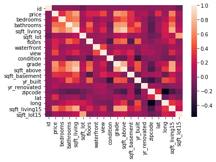

# Multiple Linear Regression


```python
import numpy as np 
import pandas as pd 
import matplotlib.pyplot as plt 
```


```python
#Import DataSet 
dataset = pd.read_csv("house_data_new.csv",sep=',')
print(dataset.shape)
dataset.head()
```

    (21613, 21)
    


<div>
<style scoped>
    .dataframe tbody tr th:only-of-type {
        vertical-align: middle;
    }

    .dataframe tbody tr th {
        vertical-align: top;
    }

    .dataframe thead th {
        text-align: right;
    }
</style>
<table border="1" class="dataframe">
  <thead>
    <tr style="text-align: right;">
      <th></th>
      <th>id</th>
      <th>date</th>
      <th>price</th>
      <th>bedrooms</th>
      <th>bathrooms</th>
      <th>sqft_living</th>
      <th>sqft_lot</th>
      <th>floors</th>
      <th>waterfront</th>
      <th>view</th>
      <th>...</th>
      <th>grade</th>
      <th>sqft_above</th>
      <th>sqft_basement</th>
      <th>yr_built</th>
      <th>yr_renovated</th>
      <th>zipcode</th>
      <th>lat</th>
      <th>long</th>
      <th>sqft_living15</th>
      <th>sqft_lot15</th>
    </tr>
  </thead>
  <tbody>
    <tr>
      <th>0</th>
      <td>7129300520</td>
      <td>20141013T000000</td>
      <td>221900.0</td>
      <td>3</td>
      <td>1.00</td>
      <td>1180</td>
      <td>5650</td>
      <td>1.0</td>
      <td>0</td>
      <td>0</td>
      <td>...</td>
      <td>7</td>
      <td>1180</td>
      <td>0</td>
      <td>1955</td>
      <td>0</td>
      <td>98178</td>
      <td>47.5112</td>
      <td>-122.257</td>
      <td>1340</td>
      <td>5650</td>
    </tr>
    <tr>
      <th>1</th>
      <td>6414100192</td>
      <td>20141209T000000</td>
      <td>538000.0</td>
      <td>3</td>
      <td>2.25</td>
      <td>2570</td>
      <td>7242</td>
      <td>2.0</td>
      <td>0</td>
      <td>0</td>
      <td>...</td>
      <td>7</td>
      <td>2170</td>
      <td>400</td>
      <td>1951</td>
      <td>1991</td>
      <td>98125</td>
      <td>47.7210</td>
      <td>-122.319</td>
      <td>1690</td>
      <td>7639</td>
    </tr>
    <tr>
      <th>2</th>
      <td>5631500400</td>
      <td>20150225T000000</td>
      <td>180000.0</td>
      <td>2</td>
      <td>1.00</td>
      <td>770</td>
      <td>10000</td>
      <td>1.0</td>
      <td>0</td>
      <td>0</td>
      <td>...</td>
      <td>6</td>
      <td>770</td>
      <td>0</td>
      <td>1933</td>
      <td>0</td>
      <td>98028</td>
      <td>47.7379</td>
      <td>-122.233</td>
      <td>2720</td>
      <td>8062</td>
    </tr>
    <tr>
      <th>3</th>
      <td>2487200875</td>
      <td>20141209T000000</td>
      <td>604000.0</td>
      <td>4</td>
      <td>3.00</td>
      <td>1960</td>
      <td>5000</td>
      <td>1.0</td>
      <td>0</td>
      <td>0</td>
      <td>...</td>
      <td>7</td>
      <td>1050</td>
      <td>910</td>
      <td>1965</td>
      <td>0</td>
      <td>98136</td>
      <td>47.5208</td>
      <td>-122.393</td>
      <td>1360</td>
      <td>5000</td>
    </tr>
    <tr>
      <th>4</th>
      <td>1954400510</td>
      <td>20150218T000000</td>
      <td>510000.0</td>
      <td>3</td>
      <td>2.00</td>
      <td>1680</td>
      <td>8080</td>
      <td>1.0</td>
      <td>0</td>
      <td>0</td>
      <td>...</td>
      <td>8</td>
      <td>1680</td>
      <td>0</td>
      <td>1987</td>
      <td>0</td>
      <td>98074</td>
      <td>47.6168</td>
      <td>-122.045</td>
      <td>1800</td>
      <td>7503</td>
    </tr>
  </tbody>
</table>
<p>5 rows × 21 columns</p>
</div>


```python
corr=dataset.corr()
print(corr)
```

                         id     price  bedrooms  bathrooms  sqft_living  sqft_lot  \
    id             1.000000 -0.016762  0.001286   0.005160    -0.012258 -0.132109   
    price         -0.016762  1.000000  0.308350   0.525138     0.702035  0.089661   
    bedrooms       0.001286  0.308350  1.000000   0.515884     0.576671  0.031703   
    bathrooms      0.005160  0.525138  0.515884   1.000000     0.754665  0.087740   
    sqft_living   -0.012258  0.702035  0.576671   0.754665     1.000000  0.172826   
    sqft_lot      -0.132109  0.089661  0.031703   0.087740     0.172826  1.000000   
    floors         0.018525  0.256794  0.175429   0.500653     0.353949 -0.005201   
    waterfront    -0.002721  0.266369 -0.006582   0.063744     0.103818  0.021604   
    view           0.011592  0.397293  0.079532   0.187737     0.284611  0.074710   
    condition     -0.023783  0.036362  0.028472  -0.124982    -0.058753 -0.008958   
    grade          0.008130  0.667434  0.356967   0.664983     0.762704  0.113621   
    sqft_above    -0.010842  0.605567  0.477600   0.685342     0.876597  0.183512   
    sqft_basement -0.005151  0.323816  0.303093   0.283770     0.435043  0.015286   
    yr_built       0.021380  0.054012  0.154178   0.506019     0.318049  0.053080   
    yr_renovated  -0.016907  0.126434  0.018841   0.050739     0.055363  0.007644   
    zipcode       -0.008224 -0.053203 -0.152668  -0.203866    -0.199430 -0.129574   
    lat           -0.001891  0.307003 -0.008931   0.024573     0.052529 -0.085683   
    long           0.020799  0.021626  0.129473   0.223042     0.240223  0.229521   
    sqft_living15 -0.002901  0.585379  0.391638   0.568634     0.756420  0.144608   
    sqft_lot15    -0.138798  0.082447  0.029244   0.087175     0.183286  0.718557   
    
                     floors  waterfront      view  condition     grade  \
    id             0.018525   -0.002721  0.011592  -0.023783  0.008130   
    price          0.256794    0.266369  0.397293   0.036362  0.667434   
    bedrooms       0.175429   -0.006582  0.079532   0.028472  0.356967   
    bathrooms      0.500653    0.063744  0.187737  -0.124982  0.664983   
    sqft_living    0.353949    0.103818  0.284611  -0.058753  0.762704   
    sqft_lot      -0.005201    0.021604  0.074710  -0.008958  0.113621   
    floors         1.000000    0.023698  0.029444  -0.263768  0.458183   
    waterfront     0.023698    1.000000  0.401857   0.016653  0.082775   
    view           0.029444    0.401857  1.000000   0.045990  0.251321   
    condition     -0.263768    0.016653  0.045990   1.000000 -0.144674   
    grade          0.458183    0.082775  0.251321  -0.144674  1.000000   
    sqft_above     0.523885    0.072075  0.167649  -0.158214  0.755923   
    sqft_basement -0.245705    0.080588  0.276947   0.174105  0.168392   
    yr_built       0.489319   -0.026161 -0.053440  -0.361417  0.446963   
    yr_renovated   0.006338    0.092885  0.103917  -0.060618  0.014414   
    zipcode       -0.059121    0.030285  0.084827   0.003026 -0.184862   
    lat            0.049614   -0.014274  0.006157  -0.014941  0.114084   
    long           0.125419   -0.041910 -0.078400  -0.106500  0.198372   
    sqft_living15  0.279885    0.086463  0.280439  -0.092824  0.713202   
    sqft_lot15    -0.011269    0.030703  0.072575  -0.003406  0.119248   
    
                   sqft_above  sqft_basement  yr_built  yr_renovated   zipcode  \
    id              -0.010842      -0.005151  0.021380     -0.016907 -0.008224   
    price            0.605567       0.323816  0.054012      0.126434 -0.053203   
    bedrooms         0.477600       0.303093  0.154178      0.018841 -0.152668   
    bathrooms        0.685342       0.283770  0.506019      0.050739 -0.203866   
    sqft_living      0.876597       0.435043  0.318049      0.055363 -0.199430   
    sqft_lot         0.183512       0.015286  0.053080      0.007644 -0.129574   
    floors           0.523885      -0.245705  0.489319      0.006338 -0.059121   
    waterfront       0.072075       0.080588 -0.026161      0.092885  0.030285   
    view             0.167649       0.276947 -0.053440      0.103917  0.084827   
    condition       -0.158214       0.174105 -0.361417     -0.060618  0.003026   
    grade            0.755923       0.168392  0.446963      0.014414 -0.184862   
    sqft_above       1.000000      -0.051943  0.423898      0.023285 -0.261190   
    sqft_basement   -0.051943       1.000000 -0.133124      0.071323  0.074845   
    yr_built         0.423898      -0.133124  1.000000     -0.224874 -0.346869   
    yr_renovated     0.023285       0.071323 -0.224874      1.000000  0.064357   
    zipcode         -0.261190       0.074845 -0.346869      0.064357  1.000000   
    lat             -0.000816       0.110538 -0.148122      0.029398  0.267048   
    long             0.343803      -0.144765  0.409356     -0.068372 -0.564072   
    sqft_living15    0.731870       0.200355  0.326229     -0.002673 -0.279033   
    sqft_lot15       0.194050       0.017276  0.070958      0.007854 -0.147221   
    
                        lat      long  sqft_living15  sqft_lot15  
    id            -0.001891  0.020799      -0.002901   -0.138798  
    price          0.307003  0.021626       0.585379    0.082447  
    bedrooms      -0.008931  0.129473       0.391638    0.029244  
    bathrooms      0.024573  0.223042       0.568634    0.087175  
    sqft_living    0.052529  0.240223       0.756420    0.183286  
    sqft_lot      -0.085683  0.229521       0.144608    0.718557  
    floors         0.049614  0.125419       0.279885   -0.011269  
    waterfront    -0.014274 -0.041910       0.086463    0.030703  
    view           0.006157 -0.078400       0.280439    0.072575  
    condition     -0.014941 -0.106500      -0.092824   -0.003406  
    grade          0.114084  0.198372       0.713202    0.119248  
    sqft_above    -0.000816  0.343803       0.731870    0.194050  
    sqft_basement  0.110538 -0.144765       0.200355    0.017276  
    yr_built      -0.148122  0.409356       0.326229    0.070958  
    yr_renovated   0.029398 -0.068372      -0.002673    0.007854  
    zipcode        0.267048 -0.564072      -0.279033   -0.147221  
    lat            1.000000 -0.135512       0.048858   -0.086419  
    long          -0.135512  1.000000       0.334605    0.254451  
    sqft_living15  0.048858  0.334605       1.000000    0.183192  
    sqft_lot15    -0.086419  0.254451       0.183192    1.000000  
    

# HEAT MAP


```python
import seaborn as sns
sns.heatmap(corr)
```


    <matplotlib.axes._subplots.AxesSubplot at 0x20a29c1ea08>





```python
feature_cols = ['sqft_living','bathrooms','grade','sqft_above']
space=dataset[feature_cols]
price=dataset['price']
```


```python
x = np.array(space)
y = np.array(price)
```


```python
#Splitting the data into Train and Test
from sklearn.model_selection import train_test_split 
xtrain, xtest, ytrain, ytest = train_test_split(x,y,test_size=0.2, random_state=0)
print(ytrain) 
print(ytest)
```

    [495000. 635000. 382500. ... 431000. 411000. 699900.]
    [ 297000. 1578000.  562100. ...  369950.  300000.  575950.]
    


```python
#Fit Multiple linear regression on Training Set
from sklearn.linear_model import LinearRegression 
regressor = LinearRegression()
regressor.fit(xtrain, ytrain)
print("Training complete.")
```

    Training complete.
    


```python
#Apply on Test Set 
ypred = regressor.predict(xtest)
print('Predicted Data =\n',ypred)

print('Slope =\n',regressor.coef_)

print('Intercept =\n',regressor.intercept_)
```

    Predicted Data =
     [ 350809.60170938 1438192.59530085  398956.16794733 ...  300243.12927225
      169817.41553372  395588.76691402]
    Slope =
     [ 2.58571743e+02 -3.77222761e+04  1.11778835e+05 -7.50832248e+01]
    Intercept =
     -637447.4129246195
    


```python
# You can also test with your own data
# sqft_living=2000, bathrooms=2, grade=6, sqft_above=2000
regressor.predict([[2000,2,6,2000]])
```


    array([324758.08391123])


# R-SQUARED VALUE


```python
from sklearn.metrics import r2_score
r2_score(ytest, ypred)
```


    0.5481199319093966


# ERROR


```python
from sklearn import metrics
print(metrics.mean_absolute_error(ytest,ypred))
print(metrics.mean_squared_error(ytest,ypred))
print(np.sqrt(metrics.mean_squared_error(ytest,ypred)))
```

    157412.92126076441
    53739506907.39486
    231817.83129732462
    
