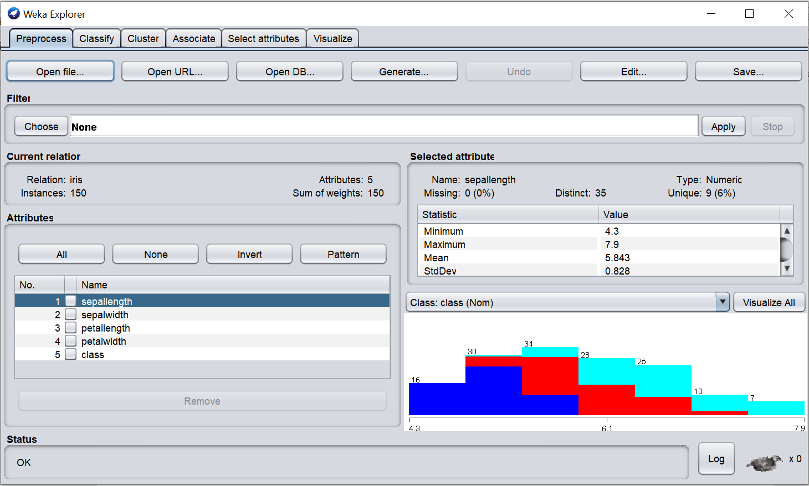

# Practical 01:  


***Aim:*** Introduction to WEKA Data Mining tool and UCI data repository 
- ARFF file
- How to load dataset?
- Show data definition
- Plot Histogram 
#

## Introduction to WEKA Data Mining tool and UCI data repository 
WEKA is a data mining system developed by the University of Waikato in New Zealand that implements data mining algorithms.It is a collection of machine learning algorithms for data mining tasks. The algorithms are applied directly to a dataset. WEKA implements algorithms for data pre-processing, classification, regression, clustering, association rules; it also includes a visualization tool.


### ARFF file
An ARFF (Attribute-Relation File Format) file is an ASCII text file that describes a list of instances sharing a set of attributes. ARFF files were developed by the Machine Learning Project at the Department of Computer Science of The University of Waikato for use with the Weka machine learning software. This document descibes the version of ARFF used with Weka versions 3.2 to 3.3; this is an extension of the ARFF format as described in the data mining book written by Ian H. Witten and Eibe Frank (the new additions are string attributes, date attributes, and sparse instances).
Overview
ARFF files have two distinct sections. The first section is the Header information, which is followed the Data information.

The Header of the ARFF file contains the name of the relation, a list of the attributes (the columns in the data), and their types. An example header on the standard IRIS dataset looks like this:
```
   % 1. Title: Iris Plants Database
   % 
   % 2. Sources:
   %      (a) Creator: R.A. Fisher
   %      (b) Donor: Michael Marshall (MARSHALL%PLU@io.arc.nasa.gov)
   %      (c) Date: July, 1988
   % 
   @RELATION iris

   @ATTRIBUTE sepallength  NUMERIC
   @ATTRIBUTE sepalwidth   NUMERIC
   @ATTRIBUTE petallength  NUMERIC
   @ATTRIBUTE petalwidth   NUMERIC
   @ATTRIBUTE class        {Iris-setosa,Iris-versicolor,Iris-virginica}
```  
The Data of the ARFF file looks like the following:
```
   @DATA
   5.1,3.5,1.4,0.2,Iris-setosa
   4.9,3.0,1.4,0.2,Iris-setosa
   4.7,3.2,1.3,0.2,Iris-setosa
   4.6,3.1,1.5,0.2,Iris-setosa
   5.0,3.6,1.4,0.2,Iris-setosa
   5.4,3.9,1.7,0.4,Iris-setosa
   4.6,3.4,1.4,0.3,Iris-setosa
   5.0,3.4,1.5,0.2,Iris-setosa
   4.4,2.9,1.4,0.2,Iris-setosa
   4.9,3.1,1.5,0.1,Iris-setosa
```  
Lines that begin with a % are comments. The @RELATION, @ATTRIBUTE and @DATA declarations are case insensitive.

### How to load dataset?
#### WEKA EXPLORER


#### Opening file from a local file system
> Click on ‘Open file…’ button.


 
#### Opening file from a web site
> Click on ‘Open URL…’ button.


### Show data definition & Plot Histogram 



- We can also view more details and histogram of one particular attribute by selecting that attribute.
- We can also drop some attributes also.
