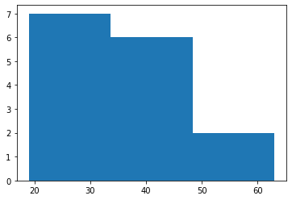

# Practical 13: Execute and analyze Linear Regression algorithm using Weka tool. 


## BINNING AND DISCRETIZATION 

Data binning (also called Discrete binning or bucketing) is a data pre-processing technique used to reduce the effects of minor observation errors. The original data values which fall into a given small interval, a bin, are replaced by a value representative of that interval, often the central value.
Binning or discretization is the process of transforming numerical variables into categorical counterparts.
There are two types of binning:
- Unsupervised Binning: Equal width binning, Equal frequency binning.
- Supervised Binning: Entropy-based binning.

```python
import pandas as pd
df = pd.read_csv('Actors.csv')
df_sorted = df.sort_values(by=['Age'])
df_sorted
```


<div>
<table border="1" class="dataframe">
  <thead>
    <tr style="text-align: right;">
      <th></th>
      <th>Name</th>
      <th>Age</th>
    </tr>
  </thead>
  <tbody>
    <tr>
      <td>0</td>
      <td>Tom</td>
      <td>19</td>
    </tr>
    <tr>
      <td>9</td>
      <td>Ron</td>
      <td>19</td>
    </tr>
    <tr>
      <td>3</td>
      <td>Daniel</td>
      <td>20</td>
    </tr>
    <tr>
      <td>11</td>
      <td>Daryn</td>
      <td>26</td>
    </tr>
    <tr>
      <td>5</td>
      <td>Christopher</td>
      <td>28</td>
    </tr>
    <tr>
      <td>13</td>
      <td>Jake</td>
      <td>29</td>
    </tr>
    <tr>
      <td>6</td>
      <td>Bryan</td>
      <td>31</td>
    </tr>
    <tr>
      <td>12</td>
      <td>Robert</td>
      <td>34</td>
    </tr>
    <tr>
      <td>8</td>
      <td>Michael</td>
      <td>35</td>
    </tr>
    <tr>
      <td>2</td>
      <td>Josan</td>
      <td>36</td>
    </tr>
    <tr>
      <td>1</td>
      <td>Smith</td>
      <td>42</td>
    </tr>
    <tr>
      <td>14</td>
      <td>Mark</td>
      <td>44</td>
    </tr>
    <tr>
      <td>10</td>
      <td>Xavier</td>
      <td>45</td>
    </tr>
    <tr>
      <td>4</td>
      <td>Bill</td>
      <td>53</td>
    </tr>
    <tr>
      <td>7</td>
      <td>Dennis</td>
      <td>63</td>
    </tr>
  </tbody>
</table>
</div>


```python
a = df_sorted['Age'].tolist()
a
```


    [19, 19, 20, 26, 28, 29, 31, 34, 35, 36, 42, 44, 45, 53, 63]


## EQUAL FREQUENCY


```python
def equifreq(arr1, m): 
      
    arr=[]
    x = len(arr1) 
    n = int(x / m) 
    for i in range(0, m): 
        temp = [] 
        for j in range(i * n, (i + 1) * n): 
            if j >= x: 
                break
            temp = temp + [arr1[j]] 
        arr += [temp]
    return arr
```

## EQUAL WIDTH 


```python
def equiwidth(arr1, m): 
    x = len(arr1) 
    w = int((max(arr1) - min(arr1)) / m) 
    min1 = min(arr1) 
    arr = [] 
    for i in range(0, m + 1): 
        arr = arr + [min1 + w * i] 
    arri=[] 
      
    for i in range(0, m): 
        temp = [] 
        for j in arr1: 
            if j >= arr[i] and j <= arr[i+1]: 
                temp += [j] 
        arri += [temp] 
    return arri  
b = 3 
  
print("equal frequency binning") 
print(equifreq(a, b))
  
print("\n\nequal width binning") 
print(equiwidth(a, b))
```

    equal frequency binning
    [[19, 19, 20, 26, 28], [29, 31, 34, 35, 36], [42, 44, 45, 53, 63]]
    
    
    equal width binning
    [[19, 19, 20, 26, 28, 29, 31], [34, 35, 36, 42, 44, 45], [53]]
    

## PLOTTING


```python
import matplotlib.pyplot as plt
plt.hist(a, bins = b)
plt.show()
```





```python
plt.hist(equifreq(a, b))
plt.show()
```


```python
plt.hist(equiwidth(a, b))
plt.show()
```


