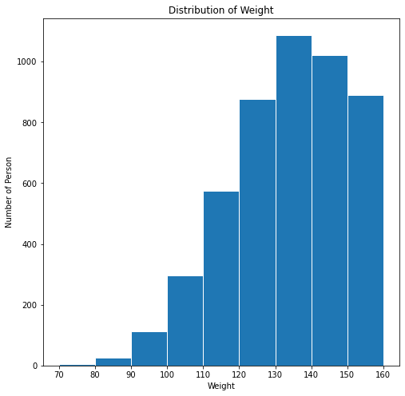

# Discretization
It is the process of putting values into buckets so that there are a limited number of possible states. It is the process of converting continuous data into discrete buckets by grouping it.
### Need for Discretization:
- Training a model with discrete data becomes faster and more effective than when attempting the same with continuous data. Continuous-valued data contains more information, huge amounts of data and can slow down the model.
- It also reduces the Signal to Noise ratio of the data. Fitting a model to bins reduces the impact that small fluctuates in the data has on the model.

### Discretization techniques can be categorized based on whether it uses class information, as:
- Supervised discretization - the discretization process uses class information
- Unsupervised discretization - the discretization process does not use class information

#### Moreover on the basis of direction it proceeds Discretization is classified into:
1. Top-down
2. Bottom-Up Approach

```python
# Importing all the necessary libraries

import pandas as pd
import numpy as np
import matplotlib.pyplot as plt
```


```python
!matplotlib inline
```

    /bin/bash: matplotlib: command not found


```python
# Importing the dataset in the form of a Pandas DataFrame

df = pd.read_csv('Data/Student.csv')
print(df.shape)
df.head(10)
```

    (232, 5)
    


<div>
<table border="1" class="dataframe">
  <thead>
    <tr style="text-align: right;">
      <th></th>
      <th>Student_id</th>
      <th>Age</th>
      <th>Grade</th>
      <th>Employed</th>
      <th>marks</th>
    </tr>
  </thead>
  <tbody>
    <tr>
      <th>0</th>
      <td>1</td>
      <td>19</td>
      <td>1st Class</td>
      <td>yes</td>
      <td>29</td>
    </tr>
    <tr>
      <th>1</th>
      <td>2</td>
      <td>20</td>
      <td>2nd Class</td>
      <td>no</td>
      <td>41</td>
    </tr>
    <tr>
      <th>2</th>
      <td>3</td>
      <td>18</td>
      <td>1st Class</td>
      <td>no</td>
      <td>57</td>
    </tr>
    <tr>
      <th>3</th>
      <td>4</td>
      <td>21</td>
      <td>2nd Class</td>
      <td>no</td>
      <td>29</td>
    </tr>
    <tr>
      <th>4</th>
      <td>5</td>
      <td>19</td>
      <td>1st Class</td>
      <td>no</td>
      <td>57</td>
    </tr>
    <tr>
      <th>5</th>
      <td>6</td>
      <td>20</td>
      <td>2nd Class</td>
      <td>yes</td>
      <td>53</td>
    </tr>
    <tr>
      <th>6</th>
      <td>7</td>
      <td>19</td>
      <td>3rd Class</td>
      <td>yes</td>
      <td>78</td>
    </tr>
    <tr>
      <th>7</th>
      <td>8</td>
      <td>21</td>
      <td>3rd Class</td>
      <td>yes</td>
      <td>70</td>
    </tr>
    <tr>
      <th>8</th>
      <td>9</td>
      <td>22</td>
      <td>3rd Class</td>
      <td>yes</td>
      <td>97</td>
    </tr>
    <tr>
      <th>9</th>
      <td>10</td>
      <td>21</td>
      <td>1st Class</td>
      <td>no</td>
      <td>58</td>
    </tr>
  </tbody>
</table>
</div>


```python
# Unsupervised discretization technique - 

# Selected the marks column as an array from the dataframe. 5 represents the number of bins :- 
# Poor, Below_average, Average, Above_average, and Excellent

df['Category'] = pd.cut(df['marks'],5,labels=['Poor','Below_average','Average','Above_Average','Excellent'])
df.head(10)
```


<div>
<table border="1" class="dataframe">
  <thead>
    <tr style="text-align: right;">
      <th></th>
      <th>Student_id</th>
      <th>Age</th>
      <th>Grade</th>
      <th>Employed</th>
      <th>marks</th>
      <th>Category</th>
    </tr>
  </thead>
  <tbody>
    <tr>
      <th>0</th>
      <td>1</td>
      <td>19</td>
      <td>1st Class</td>
      <td>yes</td>
      <td>29</td>
      <td>Poor</td>
    </tr>
    <tr>
      <th>1</th>
      <td>2</td>
      <td>20</td>
      <td>2nd Class</td>
      <td>no</td>
      <td>41</td>
      <td>Below_average</td>
    </tr>
    <tr>
      <th>2</th>
      <td>3</td>
      <td>18</td>
      <td>1st Class</td>
      <td>no</td>
      <td>57</td>
      <td>Average</td>
    </tr>
    <tr>
      <th>3</th>
      <td>4</td>
      <td>21</td>
      <td>2nd Class</td>
      <td>no</td>
      <td>29</td>
      <td>Poor</td>
    </tr>
    <tr>
      <th>4</th>
      <td>5</td>
      <td>19</td>
      <td>1st Class</td>
      <td>no</td>
      <td>57</td>
      <td>Average</td>
    </tr>
    <tr>
      <th>5</th>
      <td>6</td>
      <td>20</td>
      <td>2nd Class</td>
      <td>yes</td>
      <td>53</td>
      <td>Average</td>
    </tr>
    <tr>
      <th>6</th>
      <td>7</td>
      <td>19</td>
      <td>3rd Class</td>
      <td>yes</td>
      <td>78</td>
      <td>Above_Average</td>
    </tr>
    <tr>
      <th>7</th>
      <td>8</td>
      <td>21</td>
      <td>3rd Class</td>
      <td>yes</td>
      <td>70</td>
      <td>Above_Average</td>
    </tr>
    <tr>
      <th>8</th>
      <td>9</td>
      <td>22</td>
      <td>3rd Class</td>
      <td>yes</td>
      <td>97</td>
      <td>Excellent</td>
    </tr>
    <tr>
      <th>9</th>
      <td>10</td>
      <td>21</td>
      <td>1st Class</td>
      <td>no</td>
      <td>58</td>
      <td>Average</td>
    </tr>
  </tbody>
</table>
</div>


```python
df['Category'].value_counts()
```


    Above_Average    51
    Poor             51
    Excellent        45
    Average          43
    Below_average    42
    Name: Category, dtype: int64


## Histogram Analysis


```python
# Unsupervised discretization technique
# Importing the dataset in the form of a Pandas DataFrame

df1 = pd.read_csv("Data/weight-height.csv")
print(df1.shape)
df1.head()

# Converting weight from lbs to kg
df1['Weight'] = df1['Weight'].apply(lambda x :x *0.453592)
df1
```

    (10000, 3)
    


<div>
<table border="1" class="dataframe">
  <thead>
    <tr style="text-align: right;">
      <th></th>
      <th>Gender</th>
      <th>Height</th>
      <th>Weight</th>
    </tr>
  </thead>
  <tbody>
    <tr>
      <th>0</th>
      <td>Male</td>
      <td>73.847017</td>
      <td>109.720985</td>
    </tr>
    <tr>
      <th>1</th>
      <td>Male</td>
      <td>68.781904</td>
      <td>73.622732</td>
    </tr>
    <tr>
      <th>2</th>
      <td>Male</td>
      <td>74.110105</td>
      <td>96.497550</td>
    </tr>
    <tr>
      <th>3</th>
      <td>Male</td>
      <td>71.730978</td>
      <td>99.809504</td>
    </tr>
    <tr>
      <th>4</th>
      <td>Male</td>
      <td>69.881796</td>
      <td>93.598619</td>
    </tr>
    <tr>
      <th>...</th>
      <td>...</td>
      <td>...</td>
      <td>...</td>
    </tr>
    <tr>
      <th>9995</th>
      <td>Female</td>
      <td>66.172652</td>
      <td>62.041159</td>
    </tr>
    <tr>
      <th>9996</th>
      <td>Female</td>
      <td>67.067155</td>
      <td>77.504315</td>
    </tr>
    <tr>
      <th>9997</th>
      <td>Female</td>
      <td>63.867992</td>
      <td>58.275377</td>
    </tr>
    <tr>
      <th>9998</th>
      <td>Female</td>
      <td>69.034243</td>
      <td>74.322166</td>
    </tr>
    <tr>
      <th>9999</th>
      <td>Female</td>
      <td>61.944246</td>
      <td>51.550324</td>
    </tr>
  </tbody>
</table>
<p>10000 rows × 3 columns</p>
</div>


```python
# plotting the data on a histogram

plt.figure(figsize=(8,8))
bins = [70,80,90,100,110,120,130,140,150,160]

plt.hist(df1['Weight'],bins = bins,edgecolor='white')

plt.xticks(bins)
plt.xlabel('Weight')
plt.ylabel('Number of Person')

plt.title('Distribution of Weight')
```


    Text(0.5, 1.0, 'Distribution of Weight')



