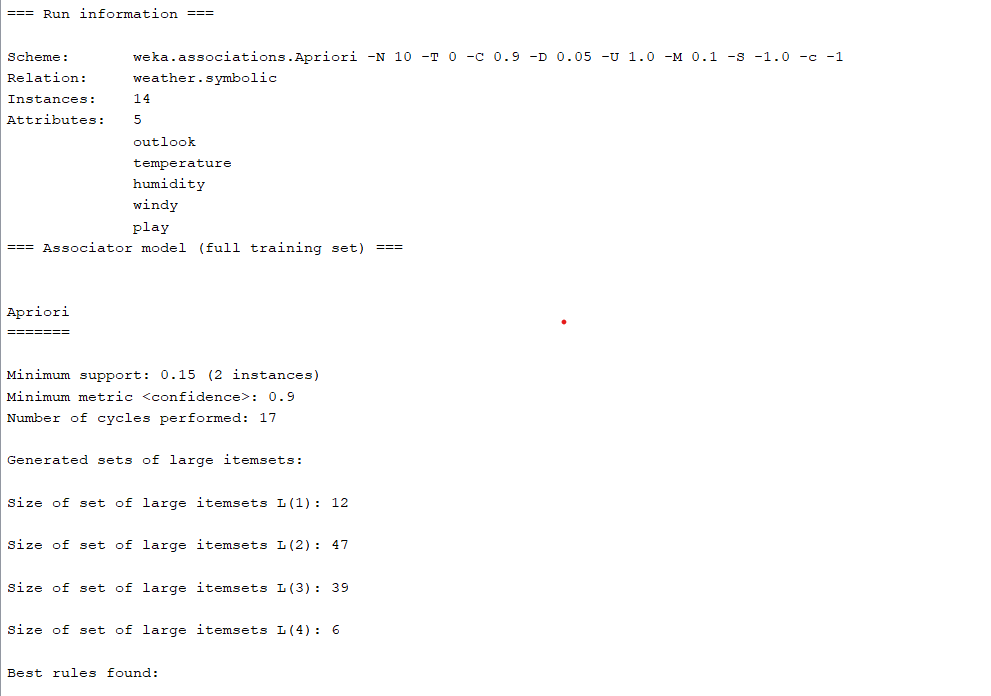
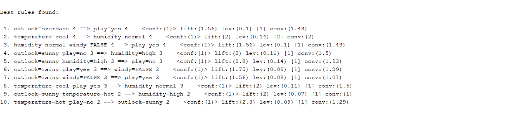
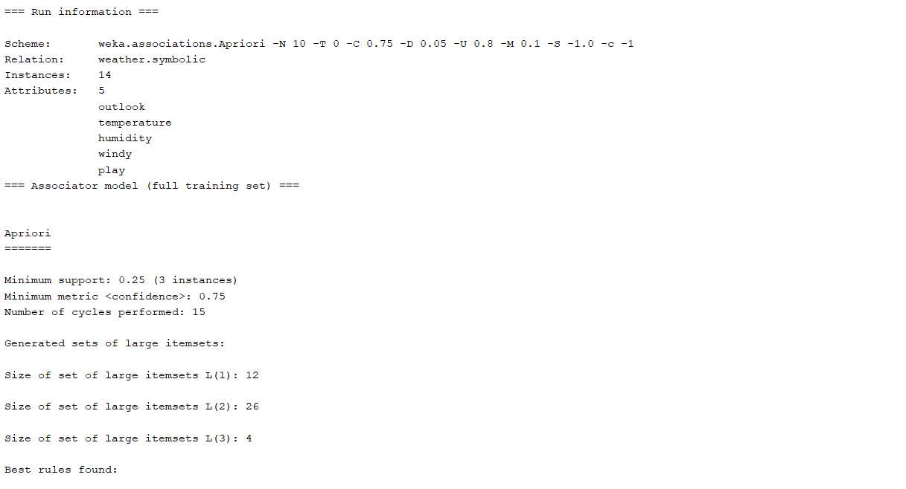
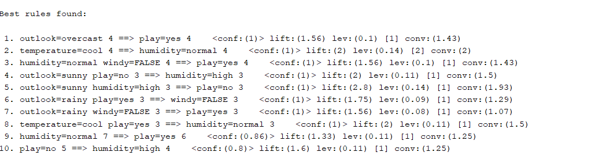
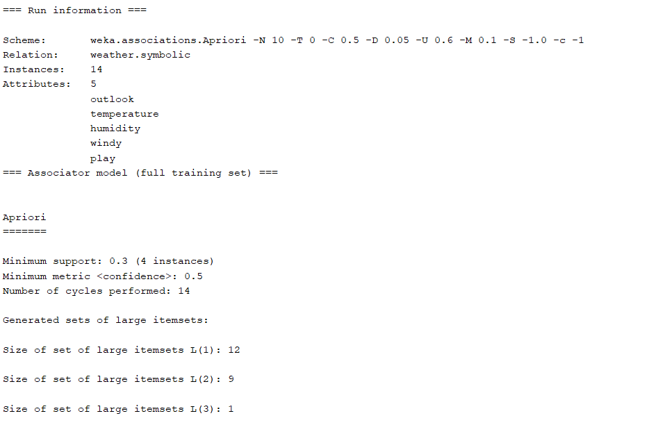
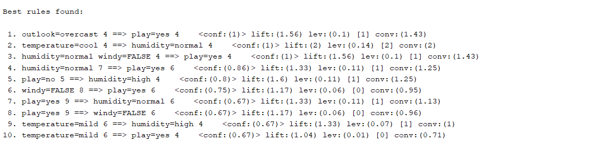

# Practical 05: 
## Execute and analyze A-priori algorithm using Weka data mining tool with different support and confidence values. Study the rules generated. 
[](https://www.linkedin.com/in/sagar-darji-7b7011165/)


### Case 1:
```
Minimum confidence: 0.9
Minimum support: 0.15
Upper bound support: 1.0
```
 




 
### Case 2:
```
Minimum confidence: 0.75
Minimum support: 0.25
Upper bound support: 0.8
```





### Case 3:
```
Minimum confidence: 0.5
Minimum support: 0.3
Upper bound support: 0.6
```





 
