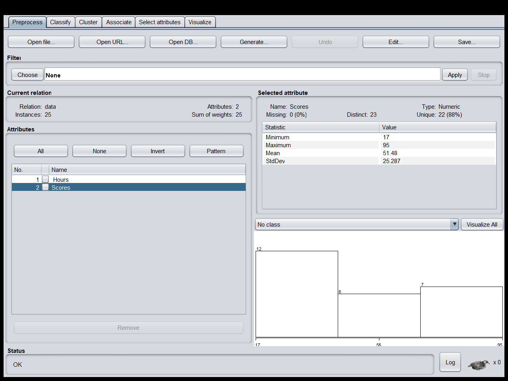
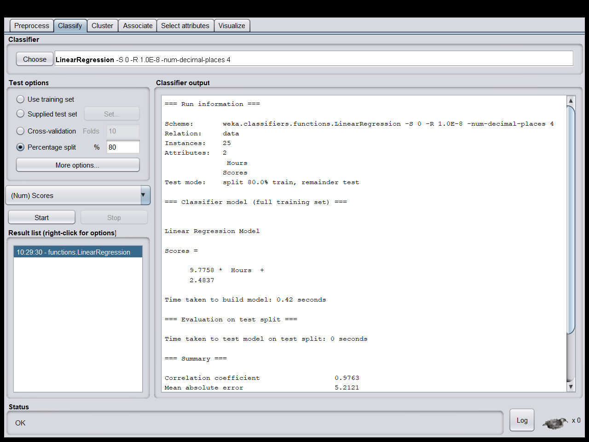

# Practical 13: Execute and analyze Linear Regression algorithm using Weka tool. 


### Datasets

|    |  Hours       | Scores |
|----|--------------|--------|
| 0  |        2.50  | 21     |
| 1  |        5.10  | 47     |
| 2  |        3.20  | 27     |
| 3  |        8.50  | 75     |
| 4  |        3.50  | 30     |
| 5  |        1.50  | 20     |
| 6  |        9.20  | 88     |
| 7  |        5.50  | 60     |
| 8  |        8.30  | 81     |
| 9  |        2.70  | 25     |
| 10 |        7.70  | 85     |
| 11 |        5.90  | 62     |
| 12 |        4.50  | 41     |
| 13 |        3.30  | 42     |
| 14 |        1.10  | 17     |
| 15 |        8.90  | 95     |
| 16 |        2.50  | 30     |
| 17 |        1.90  | 24     |
| 18 |        6.10  | 67     |
| 19 |        7.40  | 69     |
| 20 |        2.70  | 30     |
| 21 |        4.80  | 54     |
| 22 |        3.80  | 35     |
| 23 |        6.90  | 76     |
| 24 |        7.80  | 86     |

### import the Data


### Applied Linear regression


### Output on weka

```
=== Run information ===

Scheme:       weka.classifiers.functions.LinearRegression -S 0 -R 1.0E-8 -num-decimal-places 4
Relation:     data
Instances:    25
Attributes:   2
               Hours 
              Scores
Test mode:    split 80.0% train, remainder test

=== Classifier model (full training set) ===


Linear Regression Model

Scores =

      9.7758 *  Hours  +
      2.4837

Time taken to build model: 0.42 seconds

=== Evaluation on test split ===

Time taken to test model on test split: 0 seconds

=== Summary ===

Correlation coefficient                  0.9763
Mean absolute error                      5.2121
Root mean squared error                  5.8041
Relative absolute error                 23.4991 %
Root relative squared error             25.2935 %
Total Number of Instances                5     
```
