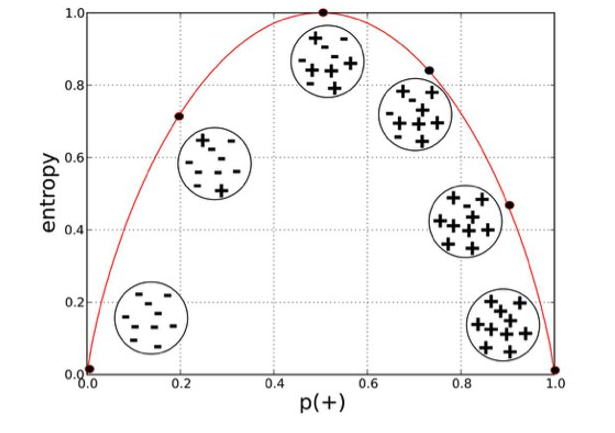

# Practical 06:


 # (a) Load different dataset into Weka and run id3, j48 classification algorithm, study the classifier output. 
### Id3: 
ID3 stands for Iterative Dichotomiser 3 and is named such because the algorithm iteratively (repeatedly) dichotomizes(divides) features into two or more groups at each step. ID3 uses a top-down greedy approach to build a decision tree. In simple words, the top-down approach means that we start building the tree from the top and the greedy approach means that at each iteration we select the best feature at the present moment to create a node. Most generally ID3 is only used for classification problems with nominal features only. 
 
 
 
### J48: 
J48 is an open source Java implementation of the C4.5 algorithm in the Weka data mining tool. C4.5 builds decision trees from a set of training data in the same way as ID3, using the concept of information entropy.


 # (b) Compute entropy values, Kappa statistics. 
 
### Entropy: 
Entropy is the measure of disorder in a dataset. It is always a calculation on a vector of categorical variable. The higher the entropy, the harder it is to draw conclusion from the data. 


### Entropy value Classification:



The x-axis measures the proportion of data points belonging to the positive class in each bubble and the y-axis axis measures their respective entropies. Right away, you can see the inverted ‘U’ shape of the graph. Entropy is lowest at the extremes, when the bubble either contains no positive instances or only positive instances. That is, when the bubble is pure the disorder is 0. Entropy is highest in the middle when the bubble is evenly split between positive and negative instances. Extreme disorder, because there is no majority.

### Kappa Statistics: 
The Kappa coefficient is a statistical measure of inter-rater reliability or agreement that is used to assess qualitative documents and determine agreement between the raters.


a = total number of instances identified as "correct" by rater 1 and rater 2 (agreement)

b = total number of instances where rater 1 said "incorrect" and rater 2 said "correct" (disagreement)

c = total number of instances where rater 1 said "correct" and rater 2 said  "incorrect" (disagreement)

d = total number of instances identified as "incorrect" by rater 1 and rater 2 (agreement)


 
where,

Pr(a) is probability of agreement, and 

Pr(e) is probability of expected agreement


|           | Correct | Incorrect |
|-----------|---------|-----------|
| Correct   | 20      | 10        |
| Incorrect | 5       | 15        |

The observed proportionate agreement is: 
> Pr(a) = (a+d) / (a+b+c+d) = 20+15 / 50 = 0.7

Expected probability that both would say correct at random is:
> Pcorrect = (a+b) / (a+b+c+d) x (a+c) / (a+b+c+d) = 0.5 x 0.6 = 0.3

Expected probability that both would say incorrect at random is:
> Pincorrect = (c+d) / (a+b+c+d) x (b+d) / (a+b+c+d) = 0.5 x 0.4 = 0.2

Overall random agreement probability is the probability that they agreed on either Correct or Incorrect i.e.:
> Pr(e) = Pcorrect + Pincorrect = 0.3 + 0.2 = 0.5

So now applying our formula for Cohen's Kappa we get:
> K = Pr(a) - Pr(e) / 1 – Pr(e) = 0.7 - 0.5 / 1 – 0.5 = 0.4

The Kappa values varies from 0 to 1, where.
```
   0 = agreement equivalent to chance.
   0.1 – 0.20 = slight agreement.
   0.21 – 0.40 = fair agreement.
   0.41 – 0.60 = moderate agreement.
   0.61 – 0.80 = substantial agreement.
   0.81 – 0.99 = near perfect agreement
   1 = perfect agreement.
```

