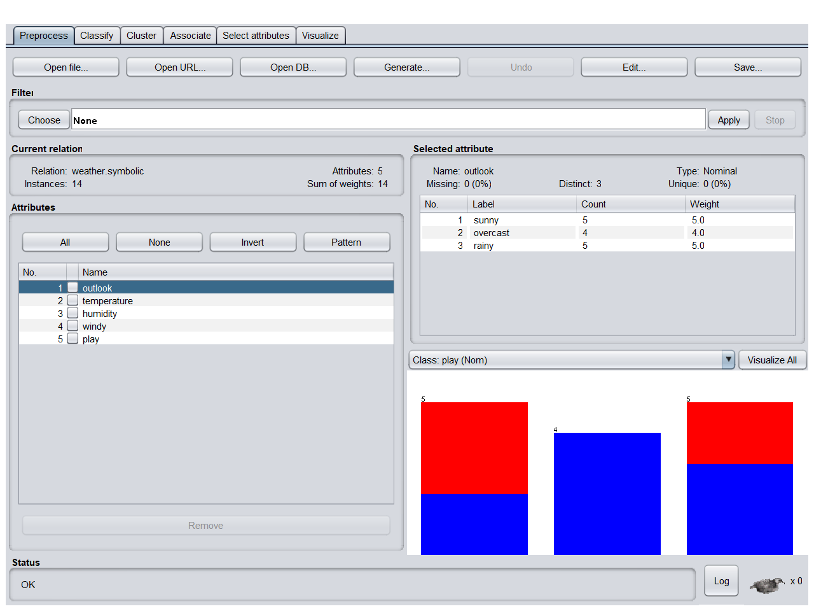
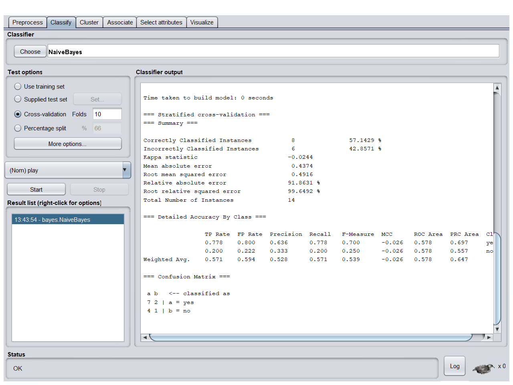

# Practical 10: Load each dataset into Weka and perform Naïve-bayes classification. Interpret the results obtained   


## Dataset 

|    | PlayTennis | Outlook  | Temperature | Humidity | Wind   |
|----|------------|----------|-------------|----------|--------|
| 0  | No         | Sunny    | Hot         | High     | Weak   |
| 1  | No         | Sunny    | Hot         | High     | Strong |
| 2  | Yes        | Overcast | Hot         | High     | Weak   |
| 3  | Yes        | Rain     | Mild        | High     | Weak   |
| 4  | Yes        | Rain     | Cool        | Normal   | Weak   |
| 5  | No         | Rain     | Cool        | Normal   | Strong |
| 6  | Yes        | Overcast | Cool        | Normal   | Strong |
| 7  | No         | Sunny    | Mild        | High     | Weak   |
| 8  | Yes        | Sunny    | Cool        | Normal   | Weak   |
| 9  | Yes        | Rain     | Mild        | Normal   | Weak   |
| 10 | Yes        | Sunny    | Mild        | Normal   | Strong |
| 11 | Yes        | Overcast | Mild        | High     | Strong |
| 12 | Yes        | Overcast | Hot         | Normal   | Weak   |
| 13 | No         | Rain     | Mild        | High     | Strong |

## Load the dataset on the Weka 

## Result

## Interpretation of theResult

```
=== Run information ===

Scheme:       weka.classifiers.bayes.NaiveBayes 
Relation:     weather.symbolic
Instances:    14
Attributes:   5
              outlook
              temperature
              humidity
              windy
              play
Test mode:    10-fold cross-validation

=== Classifier model (full training set) ===

Naive Bayes Classifier

                Class
Attribute         yes     no
               (0.63) (0.38)
=============================
outlook
  sunny            3.0    4.0
  overcast         5.0    1.0
  rainy            4.0    3.0
  [total]         12.0    8.0

temperature
  hot              3.0    3.0
  mild             5.0    3.0
  cool             4.0    2.0
  [total]         12.0    8.0

humidity
  high             4.0    5.0
  normal           7.0    2.0
  [total]         11.0    7.0

windy
  TRUE             4.0    4.0
  FALSE            7.0    3.0
  [total]         11.0    7.0


Time taken to build model: 0 seconds

=== Stratified cross-validation ===
=== Summary ===

Correctly Classified Instances           8               57.1429 %
Incorrectly Classified Instances         6               42.8571 %
Kappa statistic                         -0.0244
Mean absolute error                      0.4374
Root mean squared error                  0.4916
Relative absolute error                 91.8631 %
Root relative squared error             99.6492 %
Total Number of Instances               14     

=== Detailed Accuracy By Class ===

                 TP Rate  FP Rate  Precision  Recall   F-Measure  MCC      ROC Area  PRC Area  Class
                 0.778    0.800    0.636      0.778    0.700      -0.026   0.578     0.697     yes
                 0.200    0.222    0.333      0.200    0.250      -0.026   0.578     0.557     no
Weighted Avg.    0.571    0.594    0.528      0.571    0.539      -0.026   0.578     0.647     

=== Confusion Matrix ===

 a b   <-- classified as
 7 2 | a = yes
 4 1 | b = no

```
